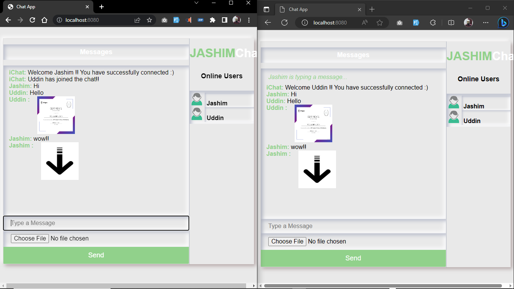

# Real-Time Chat Application

## Project Description:
The Real-Time Chat Application is a web-based chat platform that enables users to engage in real-time conversations with each other. It provides a seamless and interactive chatting experience, allowing users to send and receive messages instantly. This project utilizes technologies such as Node.js, Express.js, Socket.io, and HTML/CSS to implement the chat functionality.

## Key Features:
1. **Real-time Communication**: Users can send and receive messages instantly without the need for page refresh.
2. **Multiple User Support**: The application supports multiple users, allowing them to join and participate in group conversations.
3. **Online User List**: A dynamic list of online users is displayed, providing visibility of active participants.
4. **File Upload**: Users can upload and share files with other participants in the chat.
5. **Typing Indicator**: The application displays a typing indicator when a user is composing a message.
6. **Responsive Design**: The user interface is designed to be responsive and adaptable to different screen sizes and devices.

## Technologies Used:
- **Node.js**: Server-side JavaScript runtime environment.
- **Express.js**: Web application framework for Node.js, used for routing and handling HTTP requests.
- **Socket.io**: JavaScript library for real-time, bidirectional communication between web clients and servers.
- **HTML/CSS**: Markup language and styling to create the user interface.
- **JavaScript**: Programming language used for client-side interactions and functionality.

## Usage:
1. Clone the repository to your local machine.
2. Install the required dependencies using npm.
3. Run the server using the command `node server.js`. [i.e. node index.js]
4. Access the application through your web browser.
5. Start chatting with other users in real-time.

## Contributing:
Contributions to the project are welcome. If you encounter any issues or have suggestions for improvements, please submit a pull request or open an issue on the GitHub repository.

---

## Starting Server


## Strting Page


## Ask for username


## Chat UI


## File Share



## index.html code explanation

```html
<!DOCTYPE html>
<html>
<head>
    <meta charset="utf-8" />
    <title>Chat App</title>
    <link href="StyleSheet.css" rel="stylesheet" />
    <script src="Scripts/socket.io.slim.js"></script>
    <script src="Scripts/jquery-3.3.1.min.js"></script>
    <script src="Scripts/default.js"></script>
</head>
<body>
    <div id="main">

        <div id="container">
            <h2>Messages</h2>
            <div id="chat_area">
                <div id="feedback"></div>
                <div id="output_msg"></div>

            </div>
            <div id="input">
                <input id="message" type="text" placeholder="Type a Message" />

                <input type="file" name="uploadFile" id="uploadFile" />
            </div>
            <button id="send">Send</button>
        </div>

        <div id="user_area">
            <h1><span>JASHIM</span>Chat</h1>
            <h3>Online Users</h3> <ul id="users"></ul>
        </div>
    </div>

</body>
</html>
```

An explanation of each line of the HTML code:

1. `<!DOCTYPE html>`
   - This line declares the document type as HTML, which helps the browser understand and interpret the markup correctly.

2. `<html>`
   - This line marks the beginning of the HTML document and wraps all the HTML content.

3. `<head>`
   - This line represents the head section of the HTML document. It contains meta information and links to external resources.

4. `<meta charset="utf-8" />`
   - This line specifies the character encoding for the document, ensuring that characters from different languages and scripts can be displayed properly.

5. `<title>Chat App</title>`
   - This line sets the title of the webpage, which is displayed in the browser's title bar or tab.

6. `<link href="StyleSheet.css" rel="stylesheet" />`
   - This line includes an external CSS file named "StyleSheet.css" to style the HTML elements in the document.

7. `<script src="Scripts/socket.io.slim.js"></script>`
   - This line includes an external JavaScript file named "socket.io.slim.js". It is a library for enabling real-time communication between the client and the server using WebSockets.

8. `<script src="Scripts/jquery-3.3.1.min.js"></script>`
   - This line includes an external JavaScript file named "jquery-3.3.1.min.js". It is the jQuery library, which simplifies DOM manipulation and provides various utility functions.

9. `<script src="Scripts/default.js"></script>`
   - This line includes an external JavaScript file named "default.js". It is a custom JavaScript file that contains the logic specific to this web page.

10. `<body>`
    - This line marks the beginning of the body section of the HTML document. It contains the visible content that is rendered in the browser.

11. `<div id="main"> ... </div>`
    - This block of code represents a `<div>` element with the ID "main". It contains the main content of the page.

12. `<div id="container"> ... </div>`
    - This block of code represents a `<div>` element with the ID "container". It wraps the chat-related elements, such as the chat area, input field, and send button.

13. `<h2>Messages</h2>`
    - This line displays the heading "Messages" using the `<h2>` element.

14. `<div id="chat_area"> ... </div>`
    - This block of code represents a `<div>` element with the ID "chat_area". It represents the area where the chat messages will be displayed.

15. `<div id="feedback"></div>`
    - This line represents an empty `<div>` element with the ID "feedback". It will be used to display feedback messages, if any.

16. `<div id="output_msg"></div>`
    - This line represents an empty `<div>` element with the ID "output_msg". It will be used to display the chat messages sent by users.

17. `<div id="input"> ... </div>`
    - This block of code represents a `<div>` element with the ID "input". It contains the input field and the file upload input.

18. `<input id="message" type="text" placeholder="Type a Message" />`
    - This line creates an `<input>` element with the ID "message". It is a text input field where users can type their chat messages. It has a placeholder text "Type a Message" to provide an example or instruction to the user.

19. `<input type="file" name="uploadFile" id="uploadFile" />`
    - This line creates an `<input>`

 element with the type "file". It allows users to select and upload files from their device. It has the ID "uploadFile".

20. `<button id="send">Send</button>`
    - This line creates a `<button>` element with the ID "send". It represents a button that users can click to send their chat message.

21. `<div id="user_area"> ... </div>`
    - This block of code represents a `<div>` element with the ID "user_area". It contains the user-related elements, such as the user's name and the list of online users.

22. `<h1><span>JASHIM</span>Chat</h1>`
    - This line displays the heading "JASHIMChat" using the `<h1>` element. The word "JASHIM" is wrapped in a `<span>` element, which can be styled separately using CSS.

23. `<h3>Online Users</h3> <ul id="users"></ul>`
    - This line displays the heading "Online Users" using the `<h3>` element. It is followed by an empty `<ul>` element with the ID "users", which will be populated dynamically with the list of online users.

24. `</div>`
    - This line closes the outermost `<div>` element, with the ID "main".

25. `</body>`
    - This line marks the end of the body section of the HTML document.

26. `</html>`
    - This line marks the end of the HTML document. It wraps all the HTML content.

This HTML code represents the structure and content of a web page for a chat application. It includes various elements, such as headings, input fields, buttons, and div containers, which are styled using CSS and enhanced with JavaScript functionality.

---


## StyleSheet.css code explanation

```css
body {
    font-family: Arial, Helvetica, sans-serif;
    background-color: #e9e9e9;
}

span {
    color: #91d18b;
}

h1 {
    text-align: center;
    color: #fff;
}

h2 {
    text-align: center;
    font-size: 18px;
    padding: 10px 20px;
    color: #fff;
    box-shadow: inset 5px 5px 10px #babecc, inset -5px -5px 10px #fff;
}

h3 {
    text-align: center;
    font-size: 18px;
    padding: 10px 20px;
    color: black;
}

b {
    color: #91d18b;
}
#main {
    max-width: 700px;
    margin: 30px auto;
    background-color: rgb(214,214,214);
    box-shadow: 5px 5px 10px #b6a9a9, -5px -5px 10px #fff;
    display: flex;
}

#user_area {
    width: 25vw;
    background-color: #e9e9e9;
    border-left: 1px solid #babecc;
}

#container {
    width: 75vw;
    border: 1px solid #ddd;
    border-radius: 2px;
    background-color: #e9e9e9;
}

#chat_area {
    width: 100%;
    height: 400px;
    overflow-y: auto;
    box-shadow: inset 5px 5px 10px #babecc, inset -5px -5px 10px #fff;
}

#userImg {
    width: 100px;
    height: 100px;
    margin-left: 20px;
}

#userHeading {
    float: left;
    font-weight: bold;
    color: #91d18b;
}

#userHeading::after {
    content: " : ";
}

#output_msg {
    clear: both;
    padding: 10px 15px;
}

#output_msg #msg {
    float: left;
    padding: 0;
    margin: 0 10px;
    color: #555;
}

#output_msg p {
    float: left;
    padding: 14px 0px 0 10px;
    margin: 0 10px;
    color: #555;
}

#feedback p {
    color: #91d18b;
    padding: 14px 0px 0px 10px;
    margin: 0 10px;
    font-style: italic;
}

#output_msg strong {
    color: #575ed8;
}

#input {
    position: relative;
}


input {
    padding: 10px 20px;
    box-sizing: border-box;
    background: transparent;
    box-shadow: inset 5px 5px 10px #babecc, inset -5px -5px 10px #fff;
    border: none;
    display: block;
    width: 100%;
    font-size: 16px;
}

button {
    background-color: #91d18b;
    color: white;
    cursor: pointer;
    font-size: 18px;
    border: none;
    padding: 12px 0;
    width: 100%;
    border-radius: 0 0 2px 2px;
}

    button:hover {
        background-color: #555;
        color: #fff;
    }

#users {
    box-shadow: inset 5px 5px 10px #babecc, inset -5px -5px 10px #fff;
    padding-top: 5px;
    padding-bottom: 5px;
}

#users li {
        list-style-image: url('image/useravatar.png');
        box-shadow: inset 2px 2px 5px #babecc, inset -2px -2px 5px #fff;
        text-align:left;
        padding:1px 5px;
        font-weight:bold;
}
```

Here's an explanation of each line of the CSS code:

1. `body { ... }`
   - This block of code sets the styles for the `<body>` element. It specifies that the font family should be Arial, Helvetica, sans-serif, and the background color should be #e9e9e9.

2. `span { ... }`
   - This block of code sets the styles for `<span>` elements. It specifies that the color should be #91d18b.

3. `h1 { ... }`
   - This block of code sets the styles for `<h1>` elements. It specifies that the text should be centered, and the color should be #fff (white).

4. `h2 { ... }`
   - This block of code sets the styles for `<h2>` elements. It specifies that the text should be centered, the font size should be 18px, there should be padding of 10px on the top and bottom, the color should be #fff (white), and it has a box shadow.

5. `h3 { ... }`
   - This block of code sets the styles for `<h3>` elements. It specifies that the text should be centered, the font size should be 18px, there should be padding of 10px on the top and bottom, and the color should be black.

6. `b { ... }`
   - This block of code sets the styles for `<b>` elements. It specifies that the color should be #91d18b.

7. `#main { ... }`
   - This block of code sets the styles for an element with the ID "main". It specifies a maximum width of 700px, a margin of 30px auto (centered horizontally), a background color of rgb(214,214,214), and it has a box shadow. It also sets the display property to flex.

8. `#user_area { ... }`
   - This block of code sets the styles for an element with the ID "user_area". It specifies a width of 25vw (25% of the viewport width), a background color of #e9e9e9, and a left border of 1px solid #babecc.

9. `#container { ... }`
   - This block of code sets the styles for an element with the ID "container". It specifies a width of 75vw (75% of the viewport width), a border of 1px solid #ddd, a border radius of 2px, and a background color of #e9e9e9.

10. `#chat_area { ... }`
    - This block of code sets the styles for an element with the ID "chat_area". It specifies a width of 100%, a height of 400px, and an overflow-y property to enable vertical scrolling if the content exceeds the height. It also has a box shadow.

11. `#userImg { ... }`
    - This block of code sets the styles for an element with the ID "userImg". It specifies a width of 100px, a height of 100px, and a left margin of 20px.

12. `#userHeading { ... }`
    - This block of code sets the styles for an element with the ID "userHeading". It specifies a float of left, a font weight of bold, and a color of #91d18b.

13. `#userHeading::after { ... }`
    - This block of code sets the styles for the pseudo-element "::after" of the element with the ID "userHeading". It specifies content to be displayed as " : " after the element's content.

14. `#output_msg { ... }`
    - This block of code sets the styles for an element with the ID "output_msg". It specifies a clear property to ensure it doesn't float alongside other elements, and padding of 10px on the top and bottom, and 15px on the left and right.

15. `#output_msg #msg { ... }`
    - This block of code sets the styles for an element with the ID "msg" inside an element with the ID "output_msg". It specifies a float of left, padding and margin, and a color of #555.

16. `#output_msg p { ... }`
    - This block of code sets the styles for `<p>` elements inside an element with the ID "output_msg". It specifies a float of left, padding and margin, and a color of #555.

17. `#feedback p { ... }`
    - This block of code sets the styles for `<p>` elements inside an element with the ID "feedback". It specifies a color of #91d18b, padding and margin, and a font style of italic.

18. `#output_msg strong { ... }`
    - This block of code sets the styles for `<strong>` elements inside an element with the ID "output_msg". It specifies a color of #575ed8.

19. `#input { ... }`
    - This block of code sets the styles for an element with the ID "input". It specifies a position of relative.

20. `input { ... }`
    - This block of code sets the styles for `<input>` elements. It specifies padding, box-sizing, background, box shadow, border, display, width, and font size.

21. `button { ... }`
    - This block of code sets the styles for `<button>` elements. It specifies a background color of #91d18b, a color of white, cursor style, font size, border, padding, width, and border radius.

22. `button:hover { ... }`
    - This block of code sets the styles for `<button>` elements when hovered over. It specifies a background color of #555 and a color of #fff.

23. `#users { ... }`
    - This block of code sets the styles for an element with the ID "users". It specifies a box shadow, padding on the top and bottom.

24. `#users li { ... }`
    - This block of code sets the styles for `<li>` elements inside an element with the ID "users". It specifies a list-style image, box shadow, text alignment, padding, and font weight.

These CSS styles define various visual properties for different HTML elements and IDs, such as fonts, colors, dimensions, alignments, and shadows, to create the desired appearance for the web page or application.

---


## index.js code explanation

```node
var express = require('express');
var app = express();
var http = require('http');
var server = http.createServer(app);
var io = require('socket.io').listen(server);


app.use(express.static(__dirname + '/public'));
app.get('/', function (req, res) {
    res.sendFile(__dirname + '/public/index.html');
});


var usernames = {};

io.sockets.on('connection', function (socket) {

    socket.on('sendchat', function (data) {
        io.sockets.emit('updatechat', socket.username, data);
    });

    socket.on('adduser', function (username) {
        socket.username = username;
        usernames[username] = username;
        socket.emit('updatechat', 'iChat', 'Welcome ' + username + ' !! You have successfully connected :)');
        socket.broadcast.emit('updatechat', 'iChat'
            , username + ' has joined the chat!!');
        io.sockets.emit('updateusers', usernames);
    });

    socket.on('disconnect', function () {
        delete usernames[socket.username];
        io.sockets.emit('updateusers', usernames);
        socket.broadcast.emit('updatechat', 'iChat'
            , socket.username + ' has left the chat!!');
    });
    socket.on('typing', function () {
        socket.broadcast.emit('typing', socket.username);
    })

    socket.on('fileUpload', (data, imgurl) => {
        io.sockets.emit('fileUpload', socket.username, data, imgurl);
    });
});

var port = 8080;
server.listen(port);
console.log('Server Running On : ' + port);

```

1. `var express = require('express');`
   - This line imports the 'express' module and assigns it to the variable 'express'. The 'express' module is a web framework for Node.js that simplifies the process of building web applications.

2. `var app = express();`
   - This line creates an instance of the Express application and assigns it to the variable 'app'. The 'app' variable represents your web application.

3. `var http = require('http');`
   - This line imports the 'http' module, which is a built-in module in Node.js that allows you to create an HTTP server.

4. `var server = http.createServer(app);`
   - This line creates an HTTP server using the 'app' instance created in the previous step. The 'server' variable represents the HTTP server.

5. `var io = require('socket.io').listen(server);`
   - This line imports the 'socket.io' module and initializes it with the HTTP server created in the previous step. 'socket.io' is a library that enables real-time, bidirectional communication between web clients and servers.

6. `app.use(express.static(__dirname + '/public'));`
   - This line sets up a middleware in the Express application to serve static files from the 'public' directory. The 'public' directory contains static files like HTML, CSS, JavaScript, and images.

7. `app.get('/', function (req, res) { ... });`
   - This line sets up a route for the root URL ("/") of the web application. When a user accesses the root URL, the function specified in the second argument is executed. In this case, it sends the 'index.html' file located in the 'public' directory as the response.

8. `var usernames = {};`
   - This line creates an empty object called 'usernames' to store the usernames of connected users.

9. `io.sockets.on('connection', function (socket) { ... });`
   - This line sets up an event listener for the 'connection' event emitted by Socket.IO when a client connects to the server. The callback function is executed when a new connection is established.

10. `socket.on('sendchat', function (data) { ... });`
    - This line sets up an event listener for the 'sendchat' event emitted by a client. When a client sends a 'sendchat' event, the callback function is executed, and the server emits an 'updatechat' event to all connected clients, including the sender.

11. `socket.on('adduser', function (username) { ... });`
    - This line sets up an event listener for the 'adduser' event emitted by a client. When a client sends an 'adduser' event with a username, the callback function is executed. It stores the username in the 'socket' object, adds it to the 'usernames' object, and emits an 'updatechat' event to inform all clients about the new user.

12. `socket.on('disconnect', function () { ... });`
    - This line sets up an event listener for the 'disconnect' event emitted when a client disconnects from the server. The callback function is executed, and it removes the disconnected user's username from the 'usernames' object and informs all clients about the user's departure.

13. `socket.on('typing', function () { ... });`
    - This line sets up an event listener for the 'typing' event emitted by a client. When a client starts typing, the callback function is executed, and the server broadcasts a 'typing' event to all other connected clients, indicating that someone is typing.

14. `socket.on('fileUpload', (data, imgurl) => { ... });`
    - This line sets up an event listener for the 'fileUpload' event emitted by a client. When a client uploads a file, the callback function is executed, and the server emits a 'fileUpload' event to all connected clients, including the sender, along with the file data and image URL.

15. `var port = 8080;`
    - This line assigns the port number 8080 to the variable 'port'. You can change this value to use a different port for your server.

16. `server.listen(port);`
    - This line starts the server and listens for incoming HTTP requests on the specified port.

17. `console.log('Server Running On : ' + port);`
    - This line logs a message to the console indicating that the server is running and listening on the specified port.

---

License:
This project is licensed under the MIT License. Feel free to use, modify, and distribute the code for personal or commercial purposes.

Acknowledgments:
This project was inspired by the need for a real-time chat solution and was developed as a demonstration of socket-based communication. Special thanks to the open-source community for providing invaluable resources and libraries.

Contact:
For any inquiries or feedback, please contact the project maintainer email address.

Enjoy seamless and real-time conversations with the Real-Time Chat Application. Start chatting today!